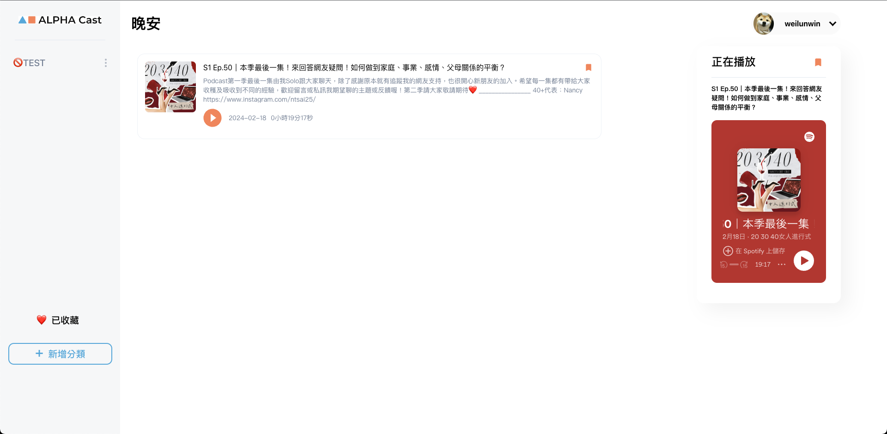

# Fake Spotify

串接第三方帳號(Spotify)登入，搭配 React 框架所打造出的微型專案。你可以在授權 Spotify 登入後，無須再次註冊，便能開始使用此 App。

功能包含新增、編輯及刪除分類，搜尋 Spotify 上的 Podcast 節目，並加入"已收藏"清單。也串接了 Spotfiy 播放器，讓你可以直接線上收聽。

## 目次

- [功能介紹]
  - [React-route-dom]
  - [Axios]
  - [React]
  - [clsx]
  - [emoji-picker-react]
  - [sweetalert2]
