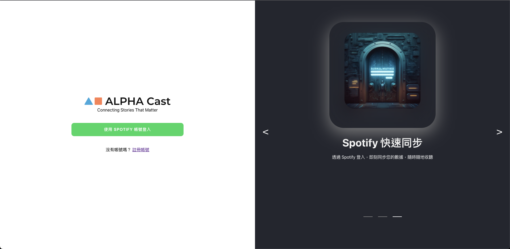
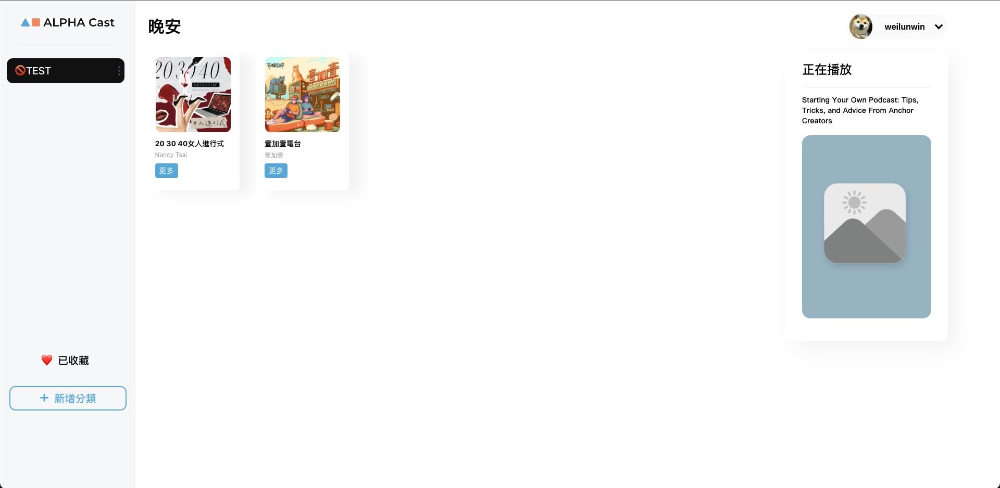

# Fake Spotify

串接第三方帳號(Spotify)登入，搭配 React 框架所打造出的微型專案。你可以在授權 Spotify 登入後，無須再次註冊，便能開始使用此 App。




## 安裝與下載

下載檔案至本地資料夾

```
git clone https://github.com/weilunwin/react_fake_spotify.git
```

開啟專案資料夾後安裝檔案

```
npm install
```

輸入執行碼

```
npm run dev
```

於瀏覽器輸入以下網址

```
http://localhost:3000/login
```
